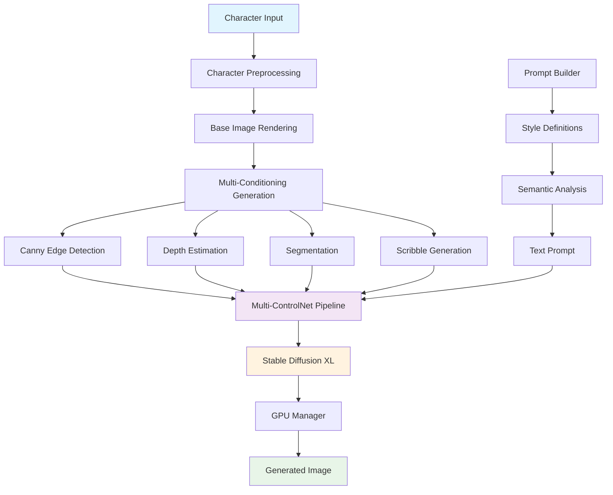

# AI Image Generation - Полное руководство

## Содержание
1. [Обзор AI системы](#обзор-ai-системы)
2. [Архитектура AI компонентов](#архитектура-ai-компонентов)
3. [Multi-ControlNet Pipeline](#multi-controlnet-pipeline)
4. [Conditioning генераторы](#conditioning-генераторы)
5. [Prompt Engineering](#prompt-engineering)
6. [GPU управление и оптимизация](#gpu-управление-и-оптимизация)
7. [Установка и настройка](#установка-и-настройка)
8. [API интеграция](#api-интеграция)
9. [Мониторинг и отладка](#мониторинг-и-отладка)
10. [Производительность и оптимизация](#производительность-и-оптимизация)
11. [Troubleshooting](#troubleshooting)

---

## Обзор AI системы

Language Learning Bot включает полноценную AI систему для генерации изображений написания слов, построенную на базе **Stable Diffusion XL** с **Multi-ControlNet** архитектурой.

### 🎯 Основные возможности:
- **Универсальная поддержка языков** - от китайского до эльфийского
- **Multi-ControlNet генерация** - одновременное использование 4 типов conditioning
- **Intelligent Prompt Engineering** - автоматическое построение промптов
- **GPU оптимизация** - автоматическая настройка под железо
- **Lazy loading** - модели загружаются при первом запросе
- **Production ready** - health monitoring, performance tracking

### 🏗️ Технологический стек:
```
🤖 AI Models:
├── Stable Diffusion XL Base 1.0        # Основная генеративная модель
├── ControlNet Canny SDXL 1.0           # Edge detection conditioning
├── ControlNet Depth SDXL 1.0           # Depth estimation conditioning
├── ControlNet Segmentation SDXL 1.0    # Сегментация conditioning
├── ControlNet Scribble SDXL 1.0        # Scribble conditioning

📚 AI Frameworks:
├── Diffusers >= 0.24.0                 # HuggingFace Diffusers
├── Transformers >= 4.35.0              # HuggingFace Transformers
├── Accelerate >= 0.24.0                # Ускорение инференса
├── XFormers >= 0.0.22                  # Attention optimization
├── ControlNet-Aux >= 0.0.9             # ControlNet utilities
├── Triton >= 2.1.0                     # CUDA kernels
└── PyTorch >= 2.1.0                    # Основной ML framework

🔧 Infrastructure:
├── CUDA 11.8                           # GPU computation
├── FastAPI                             # Web framework
├── Hydra                               # Configuration management
├── Pydantic                            # Data validation
└── AsyncIO                             # Asynchronous processing
```

---

## Архитектура AI компонентов

### 🎯 Общая схема AI pipeline:



### 🏗️ Компоненты Writing Service:

#### 1. **AI Image Generator** (`ai_image_generator.py`)
Центральный orchestrator всего AI pipeline:
```python
class AIImageGenerator:
    """Основной класс для AI генерации изображений по иероглифам"""
    
    async def generate_character_image(
        self,
        character: str,
        translation: str = "",
        conditioning_weights: Optional[Dict[str, float]] = None,
        seed: Optional[int] = None,
        **generation_params
    ) -> AIGenerationResult
```

**Workflow генерации:**
1. **Lazy model loading** - загрузка моделей при первом обращении
2. **Character preprocessing** - рендеринг иероглифа в базовое изображение
3. **Multi-conditioning** - параллельная генерация всех типов conditioning
4. **Prompt building** - построение intelligent промпта
5. **AI generation** - Multi-ControlNet + Stable Diffusion XL
6. **Result packaging** - упаковка в base64 + metadata

#### 2. **Model Loader** (`model_loader.py`)
Управление загрузкой и lifecycle AI моделей:
```python
class ModelLoader:
    """Загрузчик AI моделей для генерации изображений"""
    
    async def load_stable_diffusion_xl(self, model_name: str)
    async def load_controlnet_models(self, model_configs: Dict[str, str])
    async def load_auxiliary_models(self)
    async def setup_multi_controlnet_pipeline(self, controlnets: Dict)
```

**Features:**
- **Автоматические оптимизации** в зависимости от GPU
- **Memory tracking** - отслеживание использования памяти
- **Error recovery** - обработка ошибок загрузки
- **Performance metrics** - время загрузки каждой модели

#### 3. **GPU Manager** (`gpu_manager.py`)
Intelligent управление GPU ресурсами:
```python
class GPUManager:
    """Менеджер GPU для оптимизации производительности AI моделей"""
    
    def get_gpu_status(self) -> GPUStatus
    def optimize_pipeline(self, pipeline) -> Dict[str, bool]
    def get_recommended_batch_size(self, image_size: int) -> int
```

**Optimization Profiles:**
```python
# Ultra High Memory (80GB+)
OptimizationProfile(
    memory_efficient=False,
    attention_slicing=False,
    max_batch_size=8,
    torch_compile=True
)

# High Memory (40-80GB)
OptimizationProfile(
    memory_efficient=False,
    vae_tiling=True,
    max_batch_size=4,
    torch_compile=True
)

# Medium Memory (24-40GB)
OptimizationProfile(
    memory_efficient=True,
    attention_slicing=True,
    vae_slicing=True,
    max_batch_size=2
)

# Low Memory (12-24GB)
OptimizationProfile(
    memory_efficient=True,
    cpu_offload=True,
    max_batch_size=1
)
```

---

## Multi-ControlNet Pipeline

### 🎛️ Архитектура Multi-ControlNet:

Multi-ControlNet Pipeline объединяет **4 типа conditioning** для максимального контроля над генерацией:

```python
class MultiControlNetPipeline:
    """Multi-ControlNet pipeline для генерации с множественным conditioning"""
    
    async def generate(
        self,
        prompt: str,
        control_images: Dict[str, Image.Image] = None,
        conditioning_scales: Dict[str, float] = None,
        **generation_params
    ) -> Image.Image
```

### 🎨 Типы ControlNet и их веса:

#### **Style-based Conditioning Weights:**
```yaml
comic_style:
  canny: 0.9        # Сильные контуры для комиксов
  depth: 0.5        # Умеренная объемность
  segmentation: 0.7 # Четкие цветовые зоны
  scribble: 0.3     # Минимальная художественность

watercolor_style:
  canny: 0.4        # Размытые контуры
  depth: 0.3        # Мягкая объемность
  segmentation: 0.3 # Плавные переходы
  scribble: 0.8     # Максимальная художественная свобода

realistic_style:
  canny: 0.8        # Точные контуры
  depth: 0.9        # Сильная объемность
  segmentation: 0.6 # Реалистичные цвета
  scribble: 0.2     # Минимальная стилизация
```

### ⚡ Pipeline Optimizations:

#### **GPU Memory Optimizations:**
```python
# Автоматическая настройка в зависимости от GPU памяти
if gpu_memory >= 80:  # 80GB+
    pipeline_config = PipelineConfig(
        memory_efficient=False,
        enable_attention_slicing=False,
        max_batch_size=8,
        use_torch_compile=True
    )
elif gpu_memory >= 24:  # 24-80GB
    pipeline_config = PipelineConfig(
        memory_efficient=True,
        enable_attention_slicing=True,
        enable_vae_slicing=True,
        max_batch_size=2
    )
else:  # <24GB
    pipeline_config = PipelineConfig(
        memory_efficient=True,
        enable_cpu_offload=True,
        enable_sequential_cpu_offload=True,
        max_batch_size=1
    )
```

#### **Performance Optimizations:**
- **XFormers** - memory efficient attention
- **Torch Compile** - JIT compilation для UNet
- **Channels Last** - memory format optimization
- **VAE Optimizations** - slicing и tiling
- **CPU Offload** - для экономии GPU памяти

---

## Conditioning генераторы

### 🖼️ Четыре типа Conditioning:

#### 1. **Canny Edge Detection** (`canny_conditioning.py`)
Обнаружение контуров для структурного контроля:

```python
class CannyConditioning:
    """Генератор Canny edge conditioning изображений"""
    
    available_methods = [
        "opencv_canny",              # Классический OpenCV Canny
        "structured_edge_detection", # Structured edges
        "multi_scale_canny",         # Multi-scale подход
        "adaptive_canny"             # Adaptive thresholding
    ]
```

**Использование:**
- **Иероглифы** - четкие контуры штрихов
- **Латиница** - outline букв
- **Арабская вязь** - контуры каллиграфии

#### 2. **Depth Estimation** (`depth_conditioning.py`)
Создание depth maps для объемности:

```python
class DepthConditioning:
    """Генератор depth conditioning изображений"""
    
    available_methods = [
        "black_and_white_depth",     # Simple depth from intensity
        "stroke_thickness_depth",    # Depth based on stroke width
        "distance_transform_depth",  # Distance transform approach
        "morphological_depth",       # Morphological operations
        "multi_layer_depth"          # Layered depth construction
    ]
```

**Features:**
- **MiDaS integration** - AI-powered depth estimation
- **Stroke analysis** - глубина на основе толщины линий
- **Multi-layer** - сложная иерархия глубины

#### 3. **Segmentation** (`segmentation_conditioning.py`)
Сегментация для цветового контроля:

```python
class SegmentationConditioning:
    """Генератор segmentation conditioning изображений"""
    
    available_methods = [
        "black_and_white_segmentation", # Simple B&W segmentation
        "radical_segmentation",          # Kangxi radical-based
        "stroke_type_segmentation",     # По типам штрихов
        "color_based_segmentation"       # K-means clustering
    ]
```

**Advanced Features:**
- **Radical-based** - сегментация по radicals Kangxi
- **SAM integration** - Segment Anything Model
- **Stroke typing** - сегментация по типам штрихов (горизонтальные, вертикальные, диагональные)

#### 4. **Scribble Generation** (`scribble_conditioning.py`)
Создание художественных набросков:

```python
class ScribbleConditioning:
    """Генератор scribble conditioning изображений"""
    
    available_methods = [
        "skeletonization_scribble",      # Zhang-Suen skeletonization
        "morphological_simplification",  # Morphological thinning
        "vectorization_simplification",  # Vector-based approach
        "hand_drawn_simulation",         # Simulate hand drawing
        "multi_level_abstraction",       # Multiple abstraction levels
        "style_aware_scribble"           # Style-specific scribbles
    ]
```

**Artistic Features:**
- **Hand-drawn simulation** - имитация рисования от руки
- **Multi-level abstraction** - разные уровни детализации
- **Style awareness** - адаптация под художественный стиль

### 🔄 Parallel Conditioning Generation:

```python
async def _generate_all_conditioning(
    self,
    base_image: Image.Image,
    character: str,
) -> Dict[str, Dict[str, Image.Image]]:
    """Генерирует все типы conditioning параллельно"""
    
    # Создаем async задачи для каждого типа
    tasks = []
    for conditioning_type, generator in self.conditioning_generators.items():
        method = random.choice(generator.get_available_methods())
        task = asyncio.create_task(
            generator.generate_from_image(base_image, method=method)
        )
        tasks.append((conditioning_type, method, task))
    
    # Параллельное выполнение всех conditioning
    conditioning_images = {}
    for conditioning_type, method, task in tasks:
        result = await task
        if result.success:
            conditioning_images[conditioning_type] = {method: result.image}
    
    return conditioning_images
```

---

## Prompt Engineering

### 🎨 Style-Aware Prompt Building:

#### **Style Definitions** (`style_definitions.py`)
Comprehensive система стилевых определений:

```python
class StyleDefinitions:
    """Система определений стилей для AI генерации"""
    
    styles = {
        "comic": StyleDefinition(
            name="comic",
            display_name="Comic Book",
            base_template="A vibrant comic book style illustration of {meaning}, inspired by the Chinese character {character}, featuring bold outlines and dynamic composition",
            recommended_steps=25,
            recommended_cfg=8.0,
            controlnet_weights={"canny": 0.9, "depth": 0.5, "segmentation": 0.7, "scribble": 0.3}
        ),
        
        "watercolor": StyleDefinition(
            name="watercolor",
            display_name="Watercolor Painting",
            base_template="A soft watercolor painting depicting {meaning}, with flowing brushstrokes inspired by the Chinese character {character}, featuring delicate washes and artistic spontaneity",
            recommended_steps=35,
            recommended_cfg=6.5,
            controlnet_weights={"canny": 0.4, "depth": 0.3, "segmentation": 0.3, "scribble": 0.8}
        ),
        
        "ink": StyleDefinition(
            name="ink",
            display_name="Chinese Ink Painting",
            base_template="A traditional Chinese ink painting of {meaning}, capturing the spirit of the character {character}, with flowing brushstrokes and philosophical depth",
            recommended_steps=32,
            recommended_cfg=6.0,
            controlnet_weights={"canny": 0.6, "depth": 0.3, "segmentation": 0.2, "scribble": 0.9}
        )
    }
```

#### **Intelligent Prompt Builder** (`prompt_builder.py`)
Автоматическое построение контекстных промптов:

```python
class PromptBuilder:
    """Основной класс для построения промптов AI генерации"""
    
    async def build_prompt(
        self,
        character: str,
        translation: str = "",
        style: str = "comic",
    ) -> PromptResult:
        """Строит intelligent промпт для AI генерации"""
        
        # 1. Получение стилевых определений
        style_data = self.style_definitions.get_style_definition(style)
        
        # 2. Построение основного промпта
        main_prompt = await self._build_main_prompt(
            character=character,
            translation=translation,
            style=style,
            style_data=style_data,
        )
        
        # 3. Оптимизация длины промпта
        main_prompt = self._optimize_prompt_length(main_prompt, self.config.max_prompt_length)
        
        return PromptResult(
            success=True,
            main_prompt=main_prompt,
            style_data=style_data
        )
```

## GPU управление и оптимизация

### 🎮 Intelligent GPU Management:

#### **Hardware Detection:**
```python
def _detect_gpu_info(self) -> Dict[str, Any]:
    """Автоматическое определение характеристик GPU"""
    
    device_props = torch.cuda.get_device_properties(0)
    
    gpu_info = {
        "name": device_props.name,
        "total_memory_gb": device_props.total_memory / 1024**3,
        "compute_capability": (device_props.major, device_props.minor),
        "multi_processor_count": device_props.multi_processor_count,
    }
    
    # Extended info через pynvml
    try:
        import pynvml
        pynvml.nvmlInit()
        handle = pynvml.nvmlDeviceGetHandleByIndex(0)
        
        gpu_info["temperature_celsius"] = pynvml.nvmlDeviceGetTemperature(handle, pynvml.NVML_TEMPERATURE_GPU)
        gpu_info["power_usage_watts"] = pynvml.nvmlDeviceGetPowerUsage(handle) / 1000.0
    except:
        pass
    
    return gpu_info
```

#### **Automatic Optimization Profiles:**
```python
def _determine_optimization_profile(self) -> OptimizationProfile:
    """Автоматический выбор профиля оптимизации"""
    
    total_memory = self.gpu_info["total_memory_gb"]
    
    if total_memory >= 80:
        return OptimizationProfile(
            name="ultra_high_memory",
            memory_efficient=False,
            attention_slicing=False,
            vae_slicing=False,
            cpu_offload=False,
            max_batch_size=8,
            enable_xformers=True
        )
    elif total_memory >= 40:
        return OptimizationProfile(
            name="high_memory",
            memory_efficient=False,
            vae_tiling=True,
            max_batch_size=4,
            enable_xformers=True
        )
    elif total_memory >= 24:
        return OptimizationProfile(
            name="medium_memory",
            memory_efficient=True,
            attention_slicing=True,
            vae_slicing=True,
            max_batch_size=2,
            enable_xformers=True
        )
    else:
        return OptimizationProfile(
            name="minimal_memory",
            memory_efficient=True,
            attention_slicing=True,
            cpu_offload=True,
            sequential_cpu_offload=True,
            max_batch_size=1,
            enable_xformers=False
        )
```

#### **Memory Monitoring:**
```python
@contextmanager
def memory_monitor(self, operation_name: str = "operation"):
    """Context manager для мониторинга использования памяти"""
    
    start_time = time.time()
    memory_before = self.get_memory_usage()
    
    try:
        yield
    finally:
        end_time = time.time()
        memory_after = self.get_memory_usage()
        
        # Логирование и сохранение метрик
        operation_time = end_time - start_time
        memory_diff = memory_after.get("used_gb", 0) - memory_before.get("used_gb", 0)
        
        self.performance_history.append({
            "timestamp": start_time,
            "operation": operation_name,
            "duration_seconds": operation_time,
            "memory_diff_gb": memory_diff,
            "peak_memory_gb": memory_after.get("used_gb", 0)
        })
```

---

## Установка и настройка

### 🔧 Hardware Requirements:

#### **Minimum (12GB GPU):**
```
GPU: RTX 3080, RTX 4070 Ti, A4000
RAM: 32GB System RAM
Storage: 100GB+ для моделей и cache
CUDA: 11.8+
```

#### **Recommended (24GB+ GPU):**
```
GPU: RTX 3090, RTX 4090, A5000, A6000
RAM: 64GB System RAM
Storage: 500GB+ NVMe SSD
CUDA: 11.8+
```

#### **Optimal (80GB+ GPU):**
```
GPU: A100, H100
RAM: 128GB+ System RAM
Storage: 1TB+ NVMe SSD
CUDA: 11.8+
```

### 📦 Installation:

#### **1. GPU Environment Setup:**
```bash
# Создание AI окружения с GPU поддержкой
conda env create -f writing_service/environment_gpu.yml
conda activate amikhalev_writing_images_service

# Проверка CUDA
python -c "import torch; print(f'CUDA: {torch.cuda.is_available()}, GPU: {torch.cuda.get_device_name()}')"
```

#### **2. AI Dependencies:**
```bash
# Установка AI зависимостей
pip install -r writing_service/requirements_gpu.txt

# Проверка XFormers
python -c "import xformers; print(f'XFormers: {xformers.__version__}')"

# Проверка Diffusers
python -c "from diffusers import StableDiffusionXLPipeline; print('Diffusers OK')"
```

#### **3. Cache Directories:**
```bash
# Создание cache директорий для AI моделей
mkdir -p writing_service/cache/{huggingface,transformers,datasets,torch,pytorch_kernel_cache}

# Настройка переменных окружения
export HF_HOME="./writing_service/cache/huggingface"
export TORCH_HOME="./writing_service/cache/torch"
export TRANSFORMERS_CACHE="./writing_service/cache/transformers"
```

### ⚙️ Configuration:

#### **AI Generation Config** (`writing_service/conf/config/ai_generation.yaml`):
```yaml
ai_generation:
  enabled: true
  
  # AI Models
  models:
    base_model: "stabilityai/stable-diffusion-xl-base-1.0"
    controlnet_models:
      canny: "diffusers/controlnet-canny-sdxl-1.0"
      depth: "diffusers/controlnet-depth-sdxl-1.0"
      segmentation: "diffusers/controlnet-seg-sdxl-1.0"
      scribble: "diffusers/controlnet-scribble-sdxl-1.0"
  
  # Generation Parameters
  generation:
    num_inference_steps: 30
    guidance_scale: 7.5
    width: 1024
    height: 1024
    batch_size: 1
  
  # GPU Settings
  gpu:
    device: "cuda"
    memory_efficient: true
    enable_attention_slicing: true
    max_batch_size: 4
    use_torch_compile: true
```

---

## API интеграция

### 🌐 Writing Service API:

#### **Health Checks:**
```bash
# Базовая проверка
curl http://localhost:8600/health

# Детальная AI диагностика
curl http://localhost:8600/health/detailed

# Готовность к генерации
curl http://localhost:8600/health/ready
```

#### **AI Generation:**
```bash
# Генерация изображения
curl -X POST http://localhost:8600/api/writing/generate-writing-image \
  -H "Content-Type: application/json" \
  -d '{
    "word": "学习",
    "translation": "study",
    "language": "chinese",
    "style": "traditional",
    "width": 1024,
    "height": 1024,
    "include_conditioning_images": true,
    "include_prompt": true,
    "seed": 12345
  }'
```

#### **Response Format:**
```json
{
  "success": true,
  "status": "SUCCESS",
  "generated_image_base64": "iVBORw0KGgoAAAANS...",
  "base_image_base64": "iVBORw0KGgoAAAANS...",
  "conditioning_images_base64": {
    "canny": {"opencv_canny": "iVBORw0KGgoAAAANS..."},
    "depth": {"ai_depth_estimation": "iVBORw0KGgoAAAANS..."},
    "segmentation": {"ai_segmentation": "iVBORw0KGgoAAAANS..."},
    "scribble": {"skeletonization_scribble": "iVBORw0KGgoAAAANS..."}
  },
  "prompt_used": "A traditional Chinese calligraphy illustration of study...",
  "generation_metadata": {
    "character": "学习",
    "translation": "study",
    "generation_time_ms": 8500,
    "seed_used": 12345,
    "model_used": "stabilityai/stable-diffusion-xl-base-1.0",
    "conditioning_methods_used": {
      "canny": ["opencv_canny"],
      "depth": ["ai_depth_estimation"],
      "segmentation": ["ai_segmentation"],
      "scribble": ["skeletonization_scribble"]
    }
  }
}
```

### 🔗 Frontend Integration:

#### **API Client** (`frontend/app/api/client.py`):
```python
class APIClient:
    """API client с Writing Service интеграцией"""
    
    async def generate_writing_image(
        self,
        word: str,
        translation: str = "",
        language: str = "auto",
        style: str = "traditional",
        **kwargs
    ) -> Dict[str, Any]:
        """Генерация изображения через Writing Service"""
        
        request_data = {
            "word": word,
            "translation": translation,
            "language": language,
            "style": style,
            **kwargs
        }
        
        try:
            response = await self._make_request(
                "POST",
                f"{self.writing_service_url}/api/writing/generate-writing-image",
                json=request_data,
                timeout=30
            )
            return response
        except Exception as e:
            logger.error(f"Writing image generation failed: {e}")
            raise
```

---

## Мониторинг и отладка

### 📊 Performance Monitoring:

#### **AI Status Dashboard:**
```bash
# Статус AI компонентов
curl http://localhost:8600/api/writing/status | jq '.'

# GPU utilization
curl http://localhost:8600/health/detailed | jq '.gpu_status'

# AI generation statistics
curl http://localhost:8600/health/detailed | jq '.service_status.ai_status'
```

#### **Memory Tracking:**
```python
# В GPU Manager
def get_diagnostics(self) -> Dict[str, Any]:
    """Полная диагностическая информация"""
    
    return {
        "gpu_info": self.gpu_info,
        "optimization_profile": {
            "name": self.optimization_profile.name,
            "settings": {...}
        },
        "current_status": self.get_gpu_status().__dict__,
        "memory_history": self.memory_history[-10:],
        "performance_history": self.performance_history[-10:],
        "recommendations": self.get_optimization_recommendations()
    }
```

### 🔍 Debugging:

#### **Logging Configuration:**
```yaml
# writing_service/conf/config/logging.yaml
logging:
  level: "DEBUG"  # Для отладки AI
  loggers:
    generation:
      level: "INFO"
      include_timing: true
      include_parameters: true
    
    ai_models:
      level: "DEBUG"
      include_model_loading: true
      include_memory_usage: true
```

#### **Debug Commands:**
```bash
# Детальные логи AI генерации
tail -f writing_service/logs/writing_service.log | grep "AI"

# GPU memory monitoring
watch -n 1 'nvidia-smi'

# Model loading progress
tail -f writing_service/logs/writing_service.log | grep "Loading"
```

---

## Производительность и оптимизация

### ⚡ Performance Benchmarks:

#### **Generation Times by GPU:**
```
RTX 4090 (24GB):
├── Single image (1024x1024): ~8-12 seconds
├── Batch 2: ~14-18 seconds
└── Batch 4: ~25-35 seconds

A100 (80GB):
├── Single image: ~6-8 seconds
├── Batch 4: ~18-24 seconds
└── Batch 8: ~32-45 seconds

RTX 3080 (12GB):
├── Single image: ~12-18 seconds
├── Batch 2: ~22-30 seconds
└── Memory optimizations required
```

#### **Optimization Strategies:**
```python
# 1. Model Caching
class ModelCache:
    """Кэширование загруженных моделей"""
    
    def __init__(self):
        self.cached_models = {}
        self.cache_timestamps = {}
    
    async def get_or_load_model(self, model_key: str):
        if model_key in self.cached_models:
            return self.cached_models[model_key]
        
        # Load and cache
        model = await self._load_model(model_key)
        self.cached_models[model_key] = model
        self.cache_timestamps[model_key] = time.time()
        return model

# 2. Batch Processing
class BatchProcessor:
    """Оптимизированная batch обработка"""
    
    async def process_batch(self, requests: List[GenerationRequest]) -> List[GenerationResult]:
        # Group by similar parameters
        batches = self._group_requests(requests)
        
        results = []
        for batch in batches:
            batch_result = await self._process_single_batch(batch)
            results.extend(batch_result)
        
        return results

# 3. Memory Management
async def _optimize_memory_usage(self):
    """Агрессивная оптимизация памяти"""
    
    # Clear unused models
    await self._cleanup_unused_models()
    
    # Optimize pipeline
    if hasattr(self.pipeline, 'enable_vae_slicing'):
        self.pipeline.enable_vae_slicing()
    
    # Clear GPU cache
    torch.cuda.empty_cache()
    gc.collect()
```

### 🎯 Advanced Optimizations:

#### **Intelligent Batching:**
```python
class IntelligentBatcher:
    """Умная группировка запросов для оптимальной обработки"""
    
    def group_generation_requests(self, requests: List[GenerationRequest]) -> List[List[GenerationRequest]]:
        """Группирует запросы по совместимым параметрам"""
        
        batches = []
        current_batch = []
        
        for request in requests:
            if self._can_batch_together(current_batch, request):
                current_batch.append(request)
            else:
                if current_batch:
                    batches.append(current_batch)
                current_batch = [request]
            
            # Ограничиваем размер batch
            if len(current_batch) >= self.max_batch_size:
                batches.append(current_batch)
                current_batch = []
        
        if current_batch:
            batches.append(current_batch)
        
        return batches
    
    def _can_batch_together(self, batch: List[GenerationRequest], new_request: GenerationRequest) -> bool:
        """Проверяет совместимость запросов для batching"""
        
        if not batch:
            return True
        
        reference = batch[0]
        
        # Проверяем совместимость параметров
        compatible = (
            reference.width == new_request.width and
            reference.height == new_request.height and
            reference.num_inference_steps == new_request.num_inference_steps and
            reference.guidance_scale == new_request.guidance_scale and
            reference.style == new_request.style
        )
        
        return compatible
```

#### **Model Warming:**
```python
class ModelWarmer:
    """Прогрев моделей для быстрого старта"""
    
    async def warmup_models(self) -> Dict[str, Any]:
        """Прогревает все AI модели"""
        
        warmup_results = {}
        
        # Warmup characters для тестирования
        test_characters = ["测", "试", "验", "学", "习"]
        
        for i, char in enumerate(test_characters):
            start_time = time.time()
            
            try:
                result = await self.ai_generator.generate_character_image(
                    character=char,
                    translation=f"warmup_{i}",
                    include_conditioning_images=False,
                    include_prompt=False
                )
                
                warmup_time = time.time() - start_time
                warmup_results[char] = {
                    "success": result.success,
                    "time_ms": int(warmup_time * 1000),
                    "memory_usage": self.gpu_manager.get_memory_usage()
                }
                
                logger.info(f"Warmup {char}: {warmup_time:.2f}s")
                
            except Exception as e:
                warmup_results[char] = {
                    "success": False,
                    "error": str(e),
                    "time_ms": int((time.time() - start_time) * 1000)
                }
        
        return warmup_results
```

---

## Troubleshooting

### 🐛 Common Issues and Solutions:

#### **1. CUDA Out of Memory:**
```bash
# Симптомы
RuntimeError: CUDA out of memory. Tried to allocate 2.00 GiB

# Решения
# 1. Уменьшить batch size
echo "generation.batch_size: 1" >> writing_service/conf/config/ai_generation.yaml

# 2. Включить memory optimizations
echo "gpu.memory_efficient: true" >> writing_service/conf/config/ai_generation.yaml
echo "gpu.enable_attention_slicing: true" >> writing_service/conf/config/ai_generation.yaml
echo "gpu.enable_cpu_offload: true" >> writing_service/conf/config/ai_generation.yaml

# 3. Очистить GPU cache
python -c "import torch; torch.cuda.empty_cache()"
```

#### **2. Model Loading Failures:**
```bash
# Симптомы
OSError: Can't load tokenizer for 'stabilityai/stable-diffusion-xl-base-1.0'

# Решения
# 1. Проверить сетевое подключение
curl -I https://huggingface.co/stabilityai/stable-diffusion-xl-base-1.0

# 2. Очистить HuggingFace cache
rm -rf writing_service/cache/huggingface/*

# 3. Установить git-lfs
git lfs install

# 4. Ручная загрузка модели
python -c "
from diffusers import StableDiffusionXLPipeline
pipeline = StableDiffusionXLPipeline.from_pretrained('stabilityai/stable-diffusion-xl-base-1.0')
print('Model downloaded successfully')
"
```

#### **3. XFormers Issues:**
```bash
# Симптомы
ImportError: No module named 'xformers'

# Решения
# 1. Установить XFormers для вашей CUDA версии
pip install xformers --index-url https://download.pytorch.org/whl/cu118

# 2. Проверить совместимость PyTorch и XFormers
python -c "
import torch
import xformers
print(f'PyTorch: {torch.__version__}')
print(f'XFormers: {xformers.__version__}')
print(f'CUDA: {torch.version.cuda}')
"

# 3. Отключить XFormers если проблемы продолжаются
echo "gpu.enable_xformers: false" >> writing_service/conf/config/ai_generation.yaml
```

#### **4. Slow Generation Times:**
```bash
# Диагностика
# 1. Проверить GPU utilization
nvidia-smi -l 1

# 2. Проверить конфигурацию оптимизаций
curl http://localhost:8600/health/detailed | jq '.gpu_diagnostics.optimization_profile'

# 3. Включить torch.compile (если поддерживается)
echo "gpu.use_torch_compile: true" >> writing_service/conf/config/ai_generation.yaml

# 4. Проверить температуру GPU
curl http://localhost:8600/health/detailed | jq '.gpu_status.temperature_celsius'
```

### 🔧 Performance Debugging:

#### **Profiling AI Generation:**
```python
import time
import torch.profiler

class AIProfiler:
    """Профилирование AI генерации"""
    
    def __init__(self):
        self.generation_times = []
        self.memory_usage = []
    
    async def profile_generation(self, character: str) -> Dict[str, Any]:
        """Профилирует полный цикл генерации"""
        
        profiling_results = {}
        
        with torch.profiler.profile(
            activities=[
                torch.profiler.ProfilerActivity.CPU,
                torch.profiler.ProfilerActivity.CUDA,
            ],
            record_shapes=True,
            profile_memory=True,
            with_stack=True
        ) as prof:
            
            start_time = time.time()
            memory_before = torch.cuda.memory_allocated()
            
            # Генерация
            result = await self.ai_generator.generate_character_image(character)
            
            end_time = time.time()
            memory_after = torch.cuda.memory_allocated()
            
            profiling_results = {
                "character": character,
                "success": result.success,
                "total_time_ms": int((end_time - start_time) * 1000),
                "memory_used_mb": (memory_after - memory_before) / 1024**2,
                "peak_memory_mb": torch.cuda.max_memory_allocated() / 1024**2
            }
        
        # Сохраняем профиль
        prof.export_chrome_trace(f"ai_profile_{character}_{int(time.time())}.json")
        
        return profiling_results
```

#### **Memory Leak Detection:**
```python
class MemoryLeakDetector:
    """Детектор утечек GPU памяти"""
    
    def __init__(self):
        self.baseline_memory = None
        self.generation_count = 0
    
    def start_monitoring(self):
        """Начинает мониторинг утечек"""
        torch.cuda.empty_cache()
        self.baseline_memory = torch.cuda.memory_allocated()
        self.generation_count = 0
        logger.info(f"Memory monitoring started. Baseline: {self.baseline_memory / 1024**2:.1f}MB")
    
    def check_for_leaks(self) -> Dict[str, Any]:
        """Проверяет наличие утечек памяти"""
        
        current_memory = torch.cuda.memory_allocated()
        memory_diff = current_memory - self.baseline_memory
        
        leak_detected = memory_diff > 100 * 1024**2  # 100MB threshold
        
        return {
            "leak_detected": leak_detected,
            "baseline_memory_mb": self.baseline_memory / 1024**2,
            "current_memory_mb": current_memory / 1024**2,
            "memory_diff_mb": memory_diff / 1024**2,
            "generation_count": self.generation_count,
            "memory_per_generation_mb": memory_diff / max(1, self.generation_count) / 1024**2
        }
    
    def after_generation(self):
        """Вызывается после каждой генерации"""
        self.generation_count += 1
        
        if self.generation_count % 10 == 0:  # Проверяем каждые 10 генераций
            leak_info = self.check_for_leaks()
            
            if leak_info["leak_detected"]:
                logger.warning(f"Memory leak detected! "
                             f"Diff: {leak_info['memory_diff_mb']:.1f}MB "
                             f"after {leak_info['generation_count']} generations")
                
                # Попытка очистки
                torch.cuda.empty_cache()
```

### 📈 Performance Optimization Checklist:

#### **Monitoring in Production:**
```bash
# Continuous monitoring scripts
#!/bin/bash

# Monitor AI service health
while true; do
    echo "$(date): Checking AI service health..."
    
    # Health check
    health_status=$(curl -s http://localhost:8600/health | jq -r '.status')
    echo "Health: $health_status"
    
    # GPU memory
    gpu_memory=$(curl -s http://localhost:8600/health/detailed | jq -r '.gpu_status.memory.percent_used')
    echo "GPU Memory: $gpu_memory%"
    
    # Generation count
    gen_count=$(curl -s http://localhost:8600/api/writing/status | jq -r '.result.total_generations')
    echo "Total generations: $gen_count"
    
    echo "---"
    sleep 60
done
```

---
