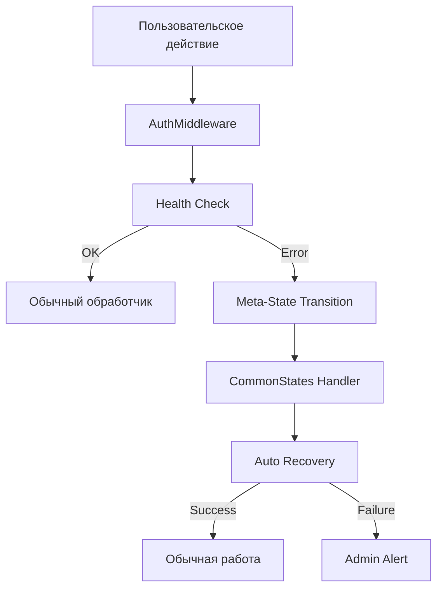

# Руководство по Meta-состояниям в Language Learning Bot

## Содержание

1. [Введение в Meta-состояния](#введение-в-meta-состояния)
2. [Типы Meta-состояний](#типы-meta-состояний)
3. [Архитектура системы](#архитектура-системы)
4. [Автоматические переходы](#автоматические-переходы)
5. [Обработчики Meta-состояний](#обработчики-meta-состояний)
6. [Система мониторинга](#система-мониторинга)
7. [Тестирование Meta-состояний](#тестирование-meta-состояний)
8. [Примеры использования](#примеры-использования)
9. [Отладка и логирование](#отладка-и-логирование)
10. [Лучшие практики](#лучшие-практики)

## Введение в Meta-состояния

Meta-состояния - это специальные состояния FSM, предназначенные для обработки системных ошибок, потери соединения и других exceptional случаев, которые могут произойти независимо от текущего пользовательского состояния.

### Зачем нужны Meta-состояния?

- **🛡️ Надежность**: Автоматическая обработка системных сбоев
- **🔄 Восстановление**: Graceful recovery без потери пользовательских данных
- **📊 Мониторинг**: Централизованное отслеживание проблем системы
- **👨‍💼 Администрирование**: Автоматические уведомления о проблемах
- **🎯 UX**: Понятные сообщения пользователям о проблемах

## Типы Meta-состояний

### 1. CommonStates.handling_api_error

**Назначение**: Обработка ошибок API (4xx, 5xx статусы)

**Когда активируется**:
- Ошибки сервера (status >= 500)
- Ошибки клиента (status >= 400)
- Проблемы с валидацией данных
- Внутренние ошибки обработчиков

**Пример активации**:
```python
# В middleware при ошибке API
if response.status >= 500:
    await state.set_state(CommonStates.handling_api_error)
    await state.update_data(
        error_details=error_msg,
        error_time=str(datetime.now()),
        error_status=response.status
    )
```

### 2. CommonStates.connection_lost

**Назначение**: Обработка потери соединения с backend

**Когда активируется**:
- Недоступность API (status = 0)
- Таймауты соединения
- Сетевые проблемы
- Недоступность MongoDB

**Пример активации**:
```python
# В middleware при проблемах соединения
try:
    health_response = await api_client._make_request("GET", "/health")
    if not health_response.get("success"):
        await state.set_state(CommonStates.connection_lost)
except Exception as e:
    await state.set_state(CommonStates.connection_lost)
```

### 3. CommonStates.unknown_command

**Назначение**: Обработка неизвестных команд пользователя

**Когда активируется**:
- Пользователь отправляет неизвестную команду
- Команда не зарегистрирована в системе
- Опечатки в командах

**Пример активации**:
```python
# В middleware при неизвестной команде
if isinstance(event, Message) and self._is_unknown_command(event):
    await handle_unknown_command(event, state, event.text)
```

## Архитектура системы

### Компоненты системы Meta-состояний



### Файловая структура

```
frontend/app/
├── bot/handlers/common_handlers.py     # Обработчики Meta-состояний
├── bot/middleware/auth_middleware.py   # Переходы в Meta-состояния
├── bot/states/centralized_states.py   # Определения Meta-состояний
└── utils/error_utils.py               # Утилиты для обработки ошибок
```

## Автоматические переходы

### Middleware-уровень

**AuthMiddleware** автоматически проверяет:
1. Доступность API клиента
2. Состояние соединения с backend
3. Валидность команд пользователя

```python
class AuthMiddleware(BaseMiddleware):
    async def __call__(self, handler, event, data):
        # Health check
        api_connectivity_ok = await self._ensure_api_connectivity(event, data, state)
        if not api_connectivity_ok:
            # Автоматический переход в Meta-состояние
            return
        
        # Unknown command check
        if isinstance(event, Message) and self._is_unknown_command(event):
            await handle_unknown_command(event, state, event.text)
            return
```

### Обработчики-уровень

**Error Utils** предоставляют функции для переходов:

```python
async def handle_api_error(response, message_obj, transition_to_error_state=True):
    if not response["success"]:
        if transition_to_error_state:
            if response.get("status") == 0:
                await _transition_to_connection_lost(message_obj)
            else:
                await _transition_to_api_error(message_obj, response.get("error"))
```

## Обработчики Meta-состояний

### Структура обработчика

```python
@common_router.message(StateFilter(CommonStates.handling_api_error))
async def handle_api_error_state(message: Message, state: FSMContext):
    """Обработка сообщений в состоянии ошибки API"""
    
    text = message.text.lower().strip() if message.text else ""
    
    if text in ["/retry", "повторить"]:
        # Попытка восстановления
        await state.clear()
        await message.answer("🔄 Попробуйте повторить последнее действие.")
    
    elif text in ["/start", "/help"]:
        # Выход из Meta-состояния
        await state.clear()
        await message.answer("Состояние сброшено. Можете продолжить работу.")
    
    else:
        # Контекстная помощь
        await send_contextual_help(state, message, "Дополнительная информация...")
```

### Callback обработчики

```python
@common_router.callback_query(StateFilter(CommonStates.connection_lost))
async def handle_connection_lost_callback(callback: CallbackQuery, state: FSMContext):
    """Обработка callback в состоянии потери соединения"""
    
    await callback.answer("❌ Нет соединения с сервером", show_alert=True)
    
    # Попытка восстановления
    health = await check_system_health(callback.bot)
    if health["api_connection"]:
        await state.clear()
        await callback.message.answer("✅ Соединение восстановлено!")
```

## Система мониторинга

### Health Check при запуске

```python
async def check_system_health(bot: Bot, api_client: APIClient) -> dict:
    """Проверка состояния системы при запуске"""
    
    health_status = {
        "bot": True,
        "api_connection": False,
        "database": False
    }
    
    try:
        # API connection test
        health_response = await api_client._make_request("GET", "/health")
        health_status["api_connection"] = health_response.get("success", False)
        
        if health_status["api_connection"]:
            # Database test through API
            languages_response = await api_client.get_languages()
            health_status["database"] = languages_response.get("success", False)
            
    except Exception as e:
        logger.error(f"Health check failed: {e}")
    
    return health_status
```

### Admin уведомления

```python
async def notify_admins_about_startup(bot: Bot, health_status: dict, admin_ids: List[int]):
    """Уведомления администраторов о состоянии системы"""
    
    status_icon = "✅" if all(health_status.values()) else "⚠️"
    
    startup_message = (
        f"{status_icon} **Бот запущен**\n\n"
        f"🤖 Бот: {'✅' if health_status['bot'] else '❌'}\n"
        f"🔗 API: {'✅' if health_status['api_connection'] else '❌'}\n"
        f"🗄️ БД: {'✅' if health_status['database'] else '❌'}\n"
        f"Время: {datetime.now().strftime('%Y-%m-%d %H:%M:%S')}"
    )
    
    for admin_id in admin_ids:
        try:
            await bot.send_message(admin_id, startup_message, parse_mode="Markdown")
        except Exception as e:
            logger.error(f"Failed to notify admin {admin_id}: {e}")
```

### Автоматическое восстановление

```python
async def auto_recover_from_error_state(state: FSMContext, message_obj) -> bool:
    """Попытка автоматического восстановления"""
    
    current_state = await state.get_state()
    
    if current_state == CommonStates.connection_lost.state:
        health = await check_system_health(message_obj.bot)
        
        if health["api_connection"]:
            # Восстанавливаем важные данные сессии
            state_data = await state.get_data()
            important_data = {
                "db_user_id": state_data.get("db_user_id"),
                "current_language": state_data.get("current_language"),
                "is_admin": state_data.get("is_admin", False)
            }
            
            await state.clear()
            await state.update_data(**{k: v for k, v in important_data.items() if v})
            
            await message_obj.answer("✅ Соединение восстановлено!")
            return True
    
    return False
```

## Тестирование Meta-состояний

### Структура тестов

```python
# frontend/tests/test_handlers/test_common/test_common_handlers.py

import pytest
from unittest.mock import AsyncMock, Mock
from app.bot.states.centralized_states import CommonStates
from app.bot.handlers.common_handlers import handle_api_error_state

class TestCommonHandlers:
    
    @pytest.mark.asyncio
    async def test_api_error_retry_command(self):
        """Тест команды retry в состоянии API error"""
        
        # Arrange
        message = Mock()
        message.text = "/retry"
        message.answer = AsyncMock()
        
        state = AsyncMock()
        state.clear = AsyncMock()
        
        # Act
        await handle_api_error_state(message, state)
        
        # Assert
        state.clear.assert_called_once()
        message.answer.assert_called_once()
    
    @pytest.mark.asyncio
    async def test_connection_lost_auto_recovery(self):
        """Тест автоматического восстановления соединения"""
        
        # Arrange
        state = AsyncMock()
        state.get_state.return_value = CommonStates.connection_lost.state
        
        message_obj = Mock()
        message_obj.bot = Mock()
        message_obj.answer = AsyncMock()
        
        # Mock successful health check
        with patch('app.utils.error_utils.check_system_health') as mock_health:
            mock_health.return_value = {"api_connection": True}
            
            # Act
            result = await auto_recover_from_error_state(state, message_obj)
            
            # Assert
            assert result is True
            message_obj.answer.assert_called_with("✅ Соединение восстановлено!")
```

### Сценарные тесты

```yaml
# frontend/tests/test_scenarios/scenarios/meta_states_recovery.yaml

name: "Meta-States Recovery Scenarios"
description: "Test automatic recovery from meta-states"

scenarios:
  - name: "API Error Recovery"
    steps:
      - action: "simulate_api_error"
        params:
          error_type: "server_error"
          status: 500
      - action: "send_message"
        params:
          text: "/retry"
      - action: "verify_state"
        expected: "normal_operation"
      - action: "verify_message"
        expected: "попробуйте повторить"

  - name: "Connection Lost Recovery"
    steps:
      - action: "simulate_connection_loss"
      - action: "wait"
        params:
          seconds: 2
      - action: "restore_connection"
      - action: "send_message"
        params:
          text: "test"
      - action: "verify_message"
        expected: "Соединение восстановлено"
```

## Примеры использования

### Пример 1: Обработка ошибки в пользовательском обработчике

```python
# В обработчике команды /study
from app.utils.error_utils import safe_api_call

async def cmd_study(message: Message, state: FSMContext, api_client):
    """Команда начала изучения с защитой от ошибок"""
    
    # Безопасный вызов API
    success, words = await safe_api_call(
        lambda: api_client.get_study_words(user_id, language_id, params),
        message,
        error_context="получение слов для изучения"
    )
    
    if not success:
        # safe_api_call автоматически перевел в Meta-состояние
        # и отправил пользователю сообщение об ошибке
        return
    
    # Продолжаем обычную логику
    await show_study_word(message, words[0], state)
```

### Пример 2: Проверка состояния системы

```python
# В административной команде
async def cmd_system_status(message: Message, api_client):
    """Команда проверки состояния системы"""
    
    health = await check_system_health(message.bot)
    
    status_text = (
        f"📊 **Статус системы:**\n\n"
        f"🤖 Бот: {'✅ Работает' if health['bot_responsive'] else '❌ Ошибка'}\n"
        f"🔗 API: {'✅ Доступен' if health['api_connection'] else '❌ Недоступен'}\n"
        f"🗄️ БД: {'✅ Доступна' if health['database_accessible'] else '❌ Недоступна'}\n"
    )
    
    await message.answer(status_text, parse_mode="Markdown")
```

### Пример 3: Graceful degradation

```python
# В middleware с graceful degradation
async def _ensure_api_connectivity(self, event, data, state):
    """Проверка API с graceful degradation"""
    
    api_client = get_api_client_from_bot(data.get("bot"))
    if not api_client:
        # Переход в Meta-состояние без прерывания работы
        await self._handle_no_api_client(event, state)
        return False
    
    try:
        health_response = await api_client._make_request("GET", "/health")
        if not health_response.get("success"):
            # Система продолжает работать, но в ограниченном режиме
            await self._handle_api_connectivity_issue(event, state, health_response)
            return False
    except Exception as e:
        # Автоматический переход в Meta-состояние
        await self._handle_api_connectivity_issue(event, state, {"error": str(e), "status": 0})
        return False
    
    return True
```

## Отладка и логирование

### Структурированное логирование

```python
# Пример логирования Meta-состояний
logger.info(f"User {user.id} transitioned to meta-state: {CommonStates.handling_api_error.state}")
logger.error(f"API Error: status={status}, error={error_msg}, user={user.id}")
logger.info(f"Auto-recovery attempt for user {user.id}: success={recovery_success}")
```

### Debug информация

```python
# В настройках пользователя можно включить отладочную информацию
async def show_debug_info(message: Message, state: FSMContext):
    """Показать отладочную информацию для Meta-состояний"""
    
    current_state = await state.get_state()
    state_data = await state.get_data()
    
    debug_text = (
        f"🔍 **Debug Info:**\n"
        f"State: {current_state}\n"
        f"Error details: {state_data.get('error_details', 'None')}\n"
        f"Error time: {state_data.get('error_time', 'None')}\n"
        f"Recovery attempts: {state_data.get('recovery_attempts', 0)}\n"
    )
    
    await message.answer(debug_text, parse_mode="Markdown")
```

### Мониторинг метрик

```python
# Сбор метрик для Meta-состояний
class MetaStateMetrics:
    def __init__(self):
        self.error_counts = defaultdict(int)
        self.recovery_success_rate = 0.0
        self.avg_recovery_time = 0.0
    
    def record_error(self, error_type: str):
        self.error_counts[error_type] += 1
    
    def record_recovery(self, success: bool, recovery_time: float):
        # Обновление метрик восстановления
        pass
```

## Лучшие практики

### 1. Проектирование обработчиков

**✅ DO:**
```python
# Сохраняйте важные данные при переходе в Meta-состояние
important_data = {
    "db_user_id": state_data.get("db_user_id"),
    "current_language": state_data.get("current_language"),
    "is_admin": state_data.get("is_admin", False)
}
await state.update_data(**important_data)
```

**❌ DON'T:**
```python
# Не очищайте состояние полностью без сохранения важных данных
await state.clear()  # Потеря всех данных пользователя!
```

### 2. Обработка ошибок

**✅ DO:**
```python
# Предоставляйте контекстную информацию об ошибке
await handle_api_error(
    response, 
    message, 
    log_prefix="Study word fetch",
    user_prefix="Ошибка получения слов"
)
```

**❌ DON'T:**
```python
# Не игнорируйте ошибки без обработки
try:
    result = await api_call()
except:
    pass  # Плохо!
```

### 3. Пользовательский опыт

**✅ DO:**
```python
# Предоставляйте четкие инструкции для восстановления
error_message = (
    "🔌 Нет соединения с сервером.\n\n"
    "Что можно сделать:\n"
    "• /retry - повторить операцию\n"
    "• /status - проверить состояние\n"
    "• /start - перезапустить бота"
)
```

**❌ DON'T:**
```python
# Не отправляйте неинформативные сообщения
await message.answer("Ошибка")  # Слишком общее!
```

### 4. Тестирование

**✅ DO:**
```python
# Тестируйте различные сценарии ошибок
@pytest.mark.parametrize("error_status", [400, 500, 502, 503])
async def test_api_error_handling(error_status):
    # Тест обработки разных типов ошибок
```

**❌ DON'T:**
```python
# Не тестируйте только "happy path"
async def test_only_success_case():
    # Недостаточно для надежной системы
```

### 5. Мониторинг

**✅ DO:**
```python
# Логируйте все переходы в Meta-состояния
logger.info(f"Meta-state transition: {user.id} -> {meta_state}")
logger.error(f"System error: {error_details}", extra={"user_id": user.id})
```

**❌ DON'T:**
```python
# Не игнорируйте мониторинг Meta-состояний
# Без логирования невозможно понять проблемы системы
```

## Заключение

Meta-состояния в Language Learning Bot обеспечивают:

- **🛡️ Высокую надежность** системы за счет автоматической обработки ошибок
- **🔄 Быстрое восстановление** после сбоев без потери пользовательских данных  
- **📊 Полную видимость** состояния системы для администраторов
- **🎯 Отличный UX** за счет понятных сообщений и инструкций восстановления
- **🚀 Готовность к продакшену** с комплексной системой мониторинга

Правильное использование Meta-состояний делает бота устойчивым к различным типам сбоев и обеспечивает непрерывную работу даже при проблемах с инфраструктурой.
